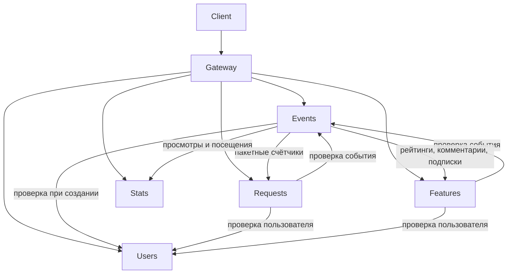

# ExploreWithMe

Сервис разделён на самостоятельные Spring Boot приложения. Внешний API доступен через Gateway на порту 8080. Схемы запросов и ответов сохранены.

## Архитектура

| Модуль | Порт | Ответственность и таблицы |
| --- | --- | --- |
| `core/event-service` | 8081 | События, категории, подборки и географические локации: `events`, `categories`, `compilations`, `compilation_events`, `locations` |
| `core/request-service` | 8082 | Заявки и подтверждение участия: `participation_requests` |
| `core/user-service` | 8083 | Администрирование пользователей: `users` |
| `core/feature-service` | 8084 | Комментарии, рейтинги и подписки: `comments`, `event_ratings`, `subscriptions` |
| `stats/stats-server` | 9090 | Статистика посещений: `endpoint_hits` |
| `infra/gateway-server` | 8080 | Маршрутизация внешних запросов |
| `infra/config-server` | 8888 | Централизованные настройки |
| `infra/discovery-server` | 8761 | Eureka, регистрация и обнаружение приложений |

`core/common` — общие DTO, ошибки, Feign-контракты и средства устойчивого чтения. В нём нет JPA-сущностей или репозиториев. Исполняемые сервисы не зависят от реализаций друг друга. `main-service` исключён из Maven reactor; в нём сохранён только старый класс запуска.

Категории, подборки и локации входят в сервис событий: их жизненный цикл и SQL-связи тесно связаны с событием. Комментарии, рейтинги и подписки выделены отдельно, поскольку их недоступность не должна блокировать выдачу событий.



Для межсервисных запросов используются OpenFeign и Spring Cloud LoadBalancer; адреса определяются через Eureka. Сервис событий хранит идентификатор и имя инициатора, комментарии — имя автора, подписки — имена участников. Эти снимки позволяют читать существующие данные без обращения к сервису пользователей.

## Конфигурация и данные

Конфигурации находятся в [infra/config-server/src/main/resources/config](infra/config-server/src/main/resources/config). `application.yaml` содержит общие настройки Eureka, Feign, тайм-аутов и Resilience4j. Файлы `<service>.yaml` задают порт и параметры базы каждого приложения. Настройки маршрутов — в `gateway-server.yaml`. Клиенты получают конфигурацию через `spring.config.import`; адрес можно переопределить переменной `CONFIG_SERVER_URL`.

Каждый бизнес-сервис имеет собственную PostgreSQL базу и Docker volume. SQL-схемы находятся в `src/main/resources/schema.sql` соответствующих модулей. Связи между сервисами представлены идентификаторами, без внешних ключей к чужим таблицам. Локальные внешние ключи и ограничения уникальности сохранены. Инициализация не удаляет существующие таблицы.

Новые базы запускаются с отдельными volumes. Автоматический перенос данных из старой монолитной базы не выполняется; старый volume следует сохранить и переносить данные отдельно с сохранением идентификаторов и заполнением полей имён.

При удалении пользователя сервис пользователей вызывает идемпотентные внутренние операции очистки событий, заявок и дополнительных данных, затем удаляет свою запись. Это несколько локальных транзакций: при частичном сбое операция возвращает ошибку и может быть повторена; общей распределённой транзакции нет.

## Внутренний API

Внутренние маршруты не опубликованы через Gateway.

| Сервис | Метод и путь | Данные |
| --- | --- | --- |
| Пользователи | `GET /internal/users/{id}` | Пользователь: id, name, email; 404 при отсутствии |
| Пользователи | `POST /internal/users/batch` | JSON-массив id → список пользователей |
| События | `GET /internal/events/{id}` | id, initiator, state, participantLimit, requestModeration |
| Заявки | `POST /internal/requests/counts` | JSON-массив id событий → объект «id: число подтверждённых заявок» |
| Дополнительные функции | `POST /internal/features/summary?userId=...` | JSON-массив id событий → ratings, comments, followed; userId необязателен |
| События, заявки, дополнительные функции | `DELETE /internal/{events,requests,features}/users/{id}` | Очистка данных пользователя |
| Заявки, дополнительные функции | `POST /internal/{requests,features}/delete-events` | JSON-массив id событий для очистки |

Пустые списки обрабатываются без запросов к другим сервисам. Для страницы событий, поиска локаций и списка подборок счётчики запрашиваются пакетно: число сетевых вызовов не растёт с количеством событий. Внутренний API проверки события не запрашивает счётчики, поэтому циклической загрузки данных нет.

Лимит участников проверяется под транзакционной PostgreSQL advisory lock по id события в сервисе заявок. Подтверждение заявки от другого события запрещено.

## Надёжность

Некритичные чтения статистики, подтверждённых заявок и дополнительных показателей защищены Resilience4j CircuitBreaker. Выполняется максимум два чтения с паузой 100 мс при транспортных ошибках и 5xx. При недоступности возвращаются нулевые счётчики и пустой список подписок. Ошибка записи посещения не блокирует выдачу события.

Проверки существования пользователя/события при изменении данных являются критичными: отсутствие возвращает 404, недоступность необходимого сервиса — 503. Записи и операции удаления автоматически не повторяются.

При отключении Eureka уже загруженный реестр продолжает использоваться. При отключении Config Server уже запущенные приложения сохраняют настройки. Для проверки режима «только сервис событий» инфраструктура может быть остановлена после запуска; PostgreSQL событий должен продолжать работать. В этом режиме проверяйте публичный API напрямую на 8081, поскольку остановленный Gateway не принимает запросы.

## Запуск и проверки

Требования: Java 21, Maven, Docker Compose.

```sh
mvn clean verify -Pcheck
docker compose up --build -d --wait
```

Gateway: [http://localhost:8080](http://localhost:8080). Eureka: [http://localhost:8761](http://localhost:8761).

Postman-коллекции находятся в `postman`. Основная и статистическая коллекции взяты из [учебного репозитория, ветка feature](https://github.com/yandex-praktikum/java-explore-with-me-plus/tree/feature/postman); адрес статистики перенаправлен на Gateway. Переменная `baseUrl` и клиент подготовительных запросов используют один адрес.

```sh
docker compose --profile test run --rm newman run ewm-main-service.json --env-var baseUrl=http://gateway-server:8080
docker compose --profile test run --rm newman run ewm-stat-service.json --env-var baseUrl=http://gateway-server:8080
docker compose --profile test run --rm newman run feature.json --env-var baseUrl=http://gateway-server:8080
```

Для остановки зависимостей и проверки нулевых показателей:

```sh
docker compose stop request-service
docker compose stop feature-service
docker compose stop stats-server
docker compose stop user-service
```

Автоматический сценарий с подготовкой данных и восстановлением сервисов: `pwsh -File scripts/Test-Resilience.ps1`.

После каждого шага проверьте `GET /events`, `GET /events/{id}` и выдачу подборок через Gateway. Затем можно остановить Gateway, Config Server и Eureka и повторить чтение напрямую через 8081. Восстановление: `docker compose up -d --wait`. Базы и volumes для проверки отказов останавливать не требуется.

Внешние спецификации: [основной API](ewm-main-service-spec.json), [статистика](ewm-stats-service-spec.json).

Версии: Spring Boot 3.3.0 и Spring Cloud 2023.0.3, совместимость подтверждена [официальными release notes](https://github.com/spring-cloud/spring-cloud-release/wiki/Spring-Cloud-2023.0-Release-Notes).

## Результаты проверки

Проверено 10 октября 2026 года: `mvn verify -Pcheck` завершился успешно (Checkstyle, SpotBugs, 71 unit-тест). Все три Postman-коллекции выполнены через Gateway: основной сервис — 232 проверки, статистика — 18, дополнительная функциональность — 84; ошибок нет.

Сценарий `scripts/Test-Resilience.ps1` прошёл все пять этапов: последовательное отключение заявок, дополнительной функциональности, статистики и пользователей, затем работа сервиса событий без остальных приложений. Отчёты Newman и сценария сохраняются в каталоге `reports/` (не включён в Git).
